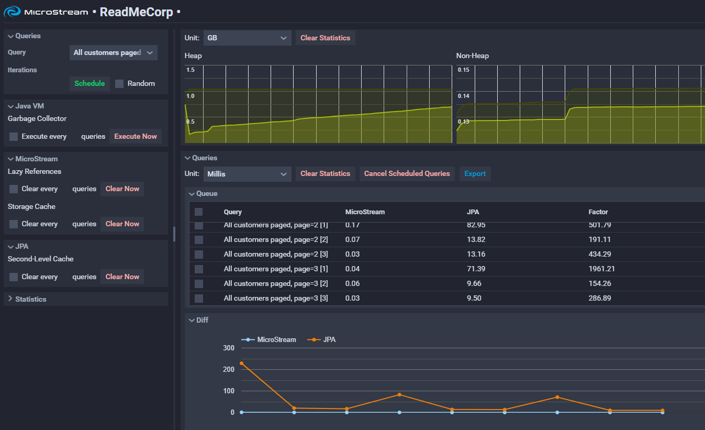

# MicroStream Performance Demo

With this demo the superior performance of MicroStream and the Java VM compared to JPA is visualized.
It is a Spring Boot application with a Vaadin frontend. Per default a Postgres database is used, but you can change the application's setup, to use any other database.

## Setup

First you need to setup a Postgres database. Then the settings must be adjusted in the `application.properties` file accordingly.

Start the program via its main class: `one.microstream.demo.readmecorp.Application`

At the first start a new MicroStream database is generated with random data. Depending on the setting `readmecorp.initialDataAmount` more or less data is generated.

The generated data will then be migrated into a SQL file, which can be imported into the Postgres database.
It can be found in the configured data directory `readmecorp.dataDir`, default is [userhome]/readmecorp.

When the database import is done, open the client interface at: [http://localhost](http://localhost)

